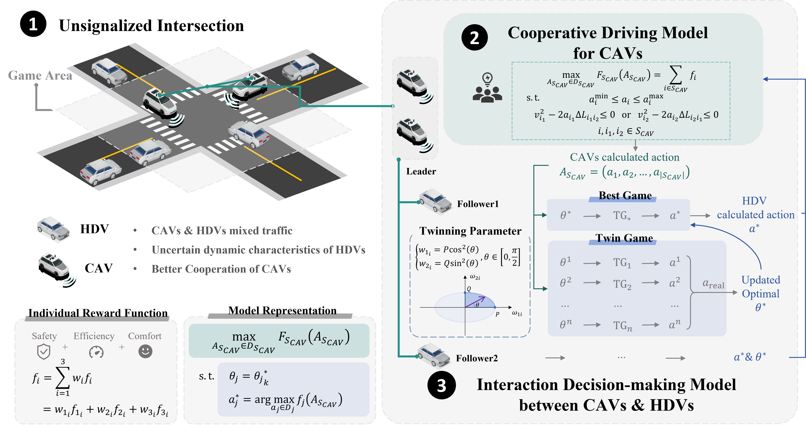

# A Game-based Framework for Cooperative Driving at Mixed Un-signalized Intersections

**[Yiming Cui](https://tops.tongji.edu.cn/info/1131/1818.htm)**, [Shiyu Fang](https://tops.tongji.edu.cn/info/1033/1190.htm), [Qian Chen](https://tops.tongji.edu.cn/info/1132/1806.htm), [Peng Hang](https://tops.tongji.edu.cn/info/1031/1383.htm), [Jian Sun](https://tops.tongji.edu.cn/info/1031/1187.htm)  

[Department of Traffic Engineering and Key Laboratory of Road and Traffic Engineering, Ministry of Education, Tongji University](https://tops.tongji.edu.cn/)  

## Abstract

During the ongoing development and proliferation of autonomous vehicles, human-driven vehicles (HDVs) and connected and automated vehicles (CAVs) will coexist in mixed traffic environments for the foreseeable future. However, current autonomous driving systems often face challenges in ensuring optimal safety and efficiency, particularly in complex conflict scenarios. To address these shortcomings and improve cooperation in mixed traffic environments, this paper presents a cooperative decision-making method based on game theory. The proposed framework accounts for both CAV-CAV collaboration and CAV-HDV interaction in mixed traffic at un-signalized intersections. this study introduces a parameter updating mechanism based on twin games to dynamically adjust HDVs' parameters to better predict and respond to variable human driving behaviors. To validate the effectiveness of the proposed cooperative driving framework, we compared its safety and efficiency with other established methods. The results demonstrate that our nethod successfully ensures both safety and efficiency in mixed traffic environments. Additionally, several validation experiments were conducted using a hardware-in-the-loop and human-in-the-loop experimental platform built on CARLA, confirming the practical applicability of the method.

## Method Overview

In terms of this complex conflict problem and realize safe and efficient cooperation in mixed traffic, we design a multi-vehicle cooperative decision-making method coupled with the interaction between CAVs and HDVs and the cooperation of CAVs based on game theory. 
For individual vehicles, we adopt a unified design of the utility function, taking into account the needs of safety, efficiency, and comfort. The total reward for an individual is represented as the weighted sum of three indices. The entire model is expressed as a bi-level optimization problem, structured such that the objective is to maximize the overall reward of cooperative CAVs, with constraints on maximizing the reward of each HDV.

Specifically, we proposed a cooperative decision-making model of the whole CAVs based on the cooperative game to achieve the decision action of CAVs. It is modeled as a single level constrained optimization problem to maximize the total rewards of CAVs. Security Hard constraints are designed to meet the most basic security guarantees between CAVs. The CAVs forming cooperative relationships need to satisfy a series of principles including individual rationality and group rationality.

Secondly, we establish an interaction model between CAV and HDV based on the Stackelberg game. In this part, we treat all CAV as a whole and build the model structure of leader-multi-followers. The model is modeled as a bi-level programming problem due to the general solving method of Stackelberg model. We designed parameters to characterize the differences in driving behavior between different human drivers and at different times in the interaction process. Moreover, we design the update rule of weight of HDV’s reward function based on the twin game, and realize the parameter adjustment to adapt to the dynamic interaction uncertainty of HDV. Security Hard constraints are designed to meet the most basic security guarantees between CAV and HDV.

Finally, to demonstrate the feasibility and effectiveness of the cooperative driving framework, cases are designed for experimental verification from multiple perspectives. We conduct the comparison of the simulation results with different methods which contains rule-based, reservation-based and reinforcement learning-based methods. Additionally, we did some validation experiments to verify the feasibility of method application including CAVs cooperative algorithm verification of domain controller in the loop and collaborative algorithm verification in mixed traffic of human driving in the loop.

## Simulation
Multiple experiments are conducted, including an ablation experiment on the Shapley value in a purely CAV environment, a comparison of efficiency and safety under different Rates of Penetration (ROP), and the significance test after heterogeneous HDVs involved. Here we focus on a supplementary explanation of the results of the study and present them in a more intuitive manner (especially via .MP4). For further knowledge acquisition, please refer to [arXiv]().

### Case1-FIFO

### Case2-Virtual IDM

### Case3-RL PPO

### Case4-Proposed NonTwin

### Case5-Proposed InTwin

| <video muted controls width=380> <source src="./src/ablation-case.mp4"  type="video/mp4"> </video> |

## Experiment

### Scenario-(1) Unprotected left turn of 2 CAVs

### Scenario-(2) Mixed traffic of 3CAV & 1HDV
Three drivers participated in this experiment. We selected the experimental results from one of the drivers and analyzed the vehicle states at several key moments as the vehicle passed through the intersection. Additionally, we plotted the acceleration curve of the HDV and the changes in the twin parameters. Observing the HDV during the $4s-13s$ interval, when it was within the interaction range considered by the model, we found that the calculated acceleration values closely matched the actual values in terms of both overall trend and magnitude. During the vehicle's operation, the twin parameters were updated according to the rules described in the methodology section. The optimal twin parameter values for different drivers did not exhibit drastic changes as seen in simulations but rather tended to stabilize. Moreover, the optimal twin parameter values varied across different drivers.

 <iframe width="560" height="315" src="https://resource.onsite.com.cn/temp/cym/cym-vedio/2CAV-上帝/2CAV-上帝.mp4" title="YouTube video player" frameborder="0" allow="accelerometer; autoplay; clipboard-write; encrypted-media; gyroscope; picture-in-picture" allowfullscreen></iframe> 

 <iframe width="560" height="315" src="https://resource.onsite.com.cn/temp/cym/cym-vedio/2CAV-hero1/2CAV-hero1.mp4" title="YouTube video player" frameborder="0" allow="accelerometer; autoplay; clipboard-write; encrypted-media; gyroscope; picture-in-picture" allowfullscreen></iframe> 

 <iframe width="560" height="315" src="https://resource.onsite.com.cn/temp/cym/cym-vedio/2CAV-hero3/2CAV-hero3.mp4" title="YouTube video player" frameborder="0" allow="accelerometer; autoplay; clipboard-write; encrypted-media; gyroscope; picture-in-picture" allowfullscreen></iframe> 

| <video muted controls width=380> <source src="https://resource.onsite.com.cn/temp/cym/cym-vedio"  type="video/gif"> </video> <video muted controls width=380> <source src="./vedio/2CAV_hero1.gif"  type="video/gif"> </video> |
In this subsection, we compare the baseline and AWSW-PG(T=1) from an aggregate point of view at first. The results indicate that the implementation of the adaptive weight method provides efficient improvement for collision avoidance. A specific case comparison is shown below  
| <video muted controls width=380> <source src="./src/baseline-case1.mp4"  type="video/mp4"> </video> <video muted controls width=380> <source src="./src/AWSW-PG(T=1)-case1.mp4"  type="video/mp4"> </video> |
As observed in the video, collisions occur when CAVs are driven by the baseline model due to their inability to correct HDV estimates in real time. However, we acknowledge that driving is a sequential decision-making process, and selecting an appropriate planning time can effectively prevent shortsighted behavior. Moreover, in our paper, we mention that though the adaptive weight method successfully helps CAVs avoid collision, it sacrifices efficiency and causes deadlocks.
Thus, we have extended the planning horizon to 8 steps. Additionally, we also present a case to visualize this improvement 
| <video muted controls width=380> <source src="./src/AWSW-PG(T=1)-case2.mp4"  type="video/mp4"> </video> <video muted controls width=380> <source src="./src/AWSW-PG(T=8)-case2.mp4"  type="video/mp4"> </video> |
### Experiments with heterogeneous HDVs involved
Considering that CAVs will continually mix with HDVs that possess various driving abilities, and styles in a long time. we further investigate our model by introducing heterogeneous human-driven vehicles into the background traffic. Specifically, we use orange, blue, and green to represent aggressive, neutral, and conservative drivers respectively (unknown information for connected autonomous vehicles). The transparency of colors indicates the discrepancy between actual actions and predicted actions. When the discrepancy between actual and predicted actions is relatively minor, HDV will be marked with a √ symbol.
| <video muted controls width=380> <source src="./src/h-hdvs-case1.mp4"  type="video/mp4"> </video> <video muted controls width=380> <source src="./src/h-hdvs-case2.mp4"  type="video/mp4"> </video> |

As observed in the video, collisions occur when CAVs are driven by the baseline model due to their inability to correct HDV estimates in real time. However, we acknowledge that driving is a sequential decision-making process, and selecting an appropriate planning time can effectively prevent shortsighted behavior. Moreover, in our paper, we mention that though the adaptive weight method successfully helps CAVs avoid collision, it sacrifices efficiency and causes deadlocks.

Thus, we have extended the planning horizon to 8 steps. Additionally, we also present a case to visualize this improvement 

## Contact

If you have any questions, feel free to contact us (2310796@tongji.edu.cn).
