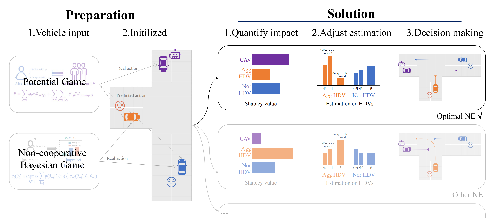

# Title

**[Shiyu Fang](https://tops.tongji.edu.cn/info/1033/1190.htm)**, [Peng Hang](https://tops.tongji.edu.cn/info/1031/1383.htm), [Jian Sun](https://tops.tongji.edu.cn/info/1031/1187.htm)  

[Department of Traffic Engineering and Key Laboratory of Road and Traffic Engineering, Ministry of Education, Tongji University](https://tops.tongji.edu.cn/)  

## Abstract

Connected Autonomous Vehicles (CAVs) technology is believed to enhance traffic efficiency and safety significantly. However, numerous accidents have demonstrated that the decision-making algorithm of CAV under highly complex environments has limitations, especially at mixed intersections. Considering the increased hazards posed by heterogeneous Human Driven Vehicles (HDVs) in real-world traffic, an Adaptive Weight Shapley Weighted Potential Game (AWSW-PG) is proposed to establish a cooperative driving framework for CAVs. Heterogeneous HDVs are modeled by a non-cooperative Bayesian game and utilized as background traffic. Then, the potential game that connects the individual reward and cluster reward generates the optimal cooperative solution by searching the Nash Equilibrium of the problem. Furthermore, the Shapley value is introduced to quantify the unsymmetrical impact of each vehicle. Finally, given the uncontrollable and unpredictable nature of HDVs, an adaptive weight method is formalized to adjust the estimation on HDVs dynamically. To evaluate the effectiveness and robustness of the proposed cooperative driving framework, three cases are conducted. Results demonstrate that the AWSW-PG framework exhibits good performance in terms of efficiency and safety under different rates of penetration. In addition, the quantification of vehicle impacts and dynamic adjustment of HDVs estimates have been proven capable of guaranteeing stability and efficiency during cooperation.

## Method Overview

Firstly, based on our previous study, we formulate a non-cooperative Bayesian game to reproduce the heterogeneous HDVs decisions. Secondly, the individual reward and potential reward (cluster reward) are linked through Potential Games (PGs). Through rigorous derivation, we further demonstrate the uniqueness and global optimality of NE in PG. Then, the Shapley value is introduced to quantify the unsymmetrical impacts of vehicles. Finally, an adaptive weight method is proposed to dynamically correct the discrepancies between HDVs' real action and predicted action.  



## Experiments
Multiple experiments are conducted, including an ablation experiment on the Shapley value in a purely CAV environment, a comparison of efficiency and safety under different Rates of Penetration (ROP), and the significance test after heterogeneous HDVs involved. Here we focus on a supplementary explanation of the results of the study and present them in a more intuitive manner (especially via .MP4). For further knowledge acquisition, please refer to [arXiv]().


### Ablation experiment on the Shapley value
In order to facilitate the reader to understand how Shapley value is constantly changing in the process of cooperation, we use the shade of color to represent the value of the Shapley value. More specifically, the closer the color of the vehicle is to purple, the higher its Shapley value is at this moment. This indicates that the vehicle currently has a greater impact on the system. Conversely, lighter colors indicate weaker impacts on the system. Additionally, each car's normalized Shapley value is displayed next to it. The cooperation case shown in Fig.5 in [arXiv]() is shown below  

<div align=center>
| <video muted controls width=380> <source src="./src/ablation-case.mp4"  type="video/mp4"> </video> |
</div>


### Comparison under different ROP
In this subsection, we compare the baseline and AWSW-PG(T=1) from an aggregate point of view at first. The results indicate that the implementation of the adaptive method provides efficient improvement for collision avoidance. A specific case comparison is shown below  

| <video muted controls width=380> <source src="./src/baseline-case1.mp4"  type="video/mp4"> </video> <video muted controls width=380> <source src="./src/h-hdvs-case2.mp4"  type="video/mp4"> </video> |

As observed in the video, collisions occur when CAVs are driven by the baseline model due to their inability to correct HDV estimates in real time. Therefore, even if all vehicles depart within a short timeframe, such situations must be avoided. However, we acknowledge that driving is a sequential decision-making process, and selecting an appropriate planning time can effectively prevent shortsighted behavior. Thus, we have extended the planning horizon to 8 steps. Additionally, we also present a case to compare the operation of the cooperation system  

| <video muted controls width=380> <source src="./src/baseline-case1.mp4"  type="video/mp4"> </video> <video muted controls width=380> <source src="./src/h-hdvs-case2.mp4"  type="video/mp4"> </video> |

### Experiments with heterogeneous HDVs involved
Considering that CAVs will continually mix with HDVs that possess various driving abilities, and styles in a long time. we further investigate our model by introducing heterogeneous human-driven vehicles into the background traffic. Specifically, we use orange, blue, and green to represent aggressive, neutral, and conservative drivers respectively (unknown information for connected autonomous vehicles). The transparency of colors indicates the discrepancy between actual actions and predicted actions. When the discrepancy between actual and predicted actions is relatively minor, HDV will be marked with a √ symbol.


| <video muted controls width=380> <source src="./src/h-hdvs-case1.mp4"  type="video/mp4"> </video> <video muted controls width=380> <source src="./src/h-hdvs-case2.mp4"  type="video/mp4"> </video> |


## Citation
```
@misc{,
      title={}, 
      author={},
      year={2023},
      eprint={},
      archivePrefix={arXiv},
      primaryClass={cs.MA}
}
```

## Contact

If you have any questions, feel free to contact us (2111219@tongji.edu.cn).
