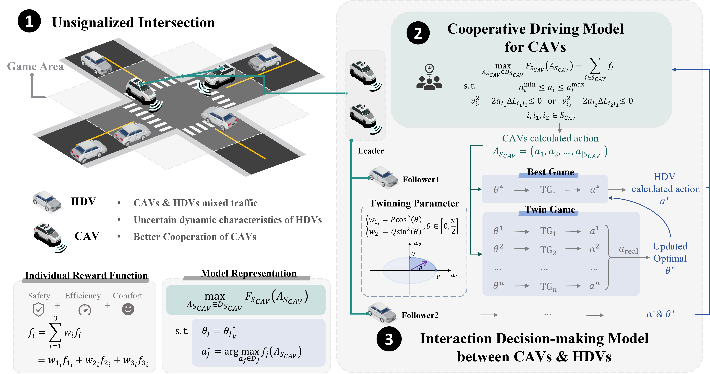

<head>
 
 
</head>

# A Game-based Framework for Cooperative Driving at Mixed Un-signalized Intersections

**[Yiming Cui](https://tops.tongji.edu.cn/info/1131/1818.htm)**, [Shiyu Fang](https://tops.tongji.edu.cn/info/1033/1190.htm), [Jiarui Zhang]https://tops.tongji.edu.cn/info/1132/1815.htm, [Yan Huang]https://tops.tongji.edu.cn/info/1033/1189.htm, [Peng Hang](https://tops.tongji.edu.cn/info/1031/1383.htm), [Jian Sun](https://tops.tongji.edu.cn/info/1031/1187.htm)  

[Department of Traffic Engineering and Key Laboratory of Road and Traffic Engineering, Ministry of Education, Tongji University](https://tops.tongji.edu.cn/)  

## Abstract

The rapid development of autonomous vehicles has led to a surge in testing demands. Efficient and reliable testing is essential not only for validating and improving algorithm performance but also serves as a prerequisite before deployment and large-scale adoption. However, conventional testing approaches face significant limitations. Purely virtual simulation tests often suffer from discrepancies between the simulated and actual vehicle state updates, as well as unrealistic behaviors of interacting agents. As for field testing, Closed-course testing is constrained by the availability and functionality of the site, while on-road testing is costly, has wide-ranging social impacts, and raises substantial safety concerns.
To overcome the shortcomings of relying solely on virtual simulation or physical testing, we propose an integrated virtual-physical testing platform VPF-ADTP that integrates a full spectrum of virtual and physical elements and covers the complete range of testing requirements. The platform combines physical components—including CAVs, cloud-controlled vehicles, and roadside infrastructure—with virtual components such as simulated CAVs, remote drivers operating via driving simulators, and background traffic flow simulations. Through flexible configuration of virtual and physical elements, the platform supports single-vehicle virtual-physical fusion tests and multi-vehicle virtual-physical fusion tests. The former includes adversarial testing and parallel deduction testing, enabling assessment of algorithmic limits under high-risk edge cases. The latter leverages V2V and V2X communications across vehicles of different automation levels to evaluate cooperative driving capabilities, as well as vehicle-infrastructure cooperation involving roadside facilities.
For evaluation, the platform adopts a multi-dimensional assessment framework to holistically measure the intelligence level of the system under test. It supports customizable metrics and evaluation schemes to meet diverse testing needs and provides targeted insights to guide algorithm enhancement. By comparing virtual-physical testing outcomes with real-world on-road test results, the credibility and reliability of the testing platform itself are also validated from multiple perspectives.

## Platform Framework
### Architecture and Components
Overall, all virtual and physical testing resources and components involved in the virtual–physical fusion testing platform are deployed in the \textbf{Virtual Environment} and \textbf{Physical Environment}, respectively.

From a scenario perspective, the physical test site is equipped with various layouts, including parking lots, straight road segments, intersections, T-junctions, roundabouts, and merging zones. Based on these, the simulation base map in the virtual environment is constructed as a high-definition map by collecting real-world test field data, enabling a one-to-one replication to serve as the geographic foundation of the platform.

From a test-element perspective, the virtual environment can provide controllable virtual background traffic flows, virtual CAVs, and remote-driven HVs, each functionally corresponding to physical CAVs of different automation levels, human-driven HVs, and cloud-controlled intelligent targets in the physical environment. This comprehensive set of traffic participants for autonomous vehicle testing can be flexibly combined to support single-vehicle and multi-vehicle testing. In addition, the physical environment is equipped with roadside infrastructure to support V2I testing requirements.
By integrating vehicle information from both virtual and physical environments, the virtual–physical fusion testing platform enables information transmission and dynamic interaction between virtual–virtual, virtual–physical, and physical–physical vehicles, thereby creating an authentic and credible testing environment.

### Platform Capabilities
By configuring virtual and physical elements on the virtual–physical fusion digital twin platform, two types of testing capabilities can be achieved: single-vehicle virtual–physical fusion testing and multi-vehicle virtual–physical fusion testing.
First, single-vehicle virtual–physical fusion testing includes adversarial testing and parallel deduction testing, enabling the evaluation of autonomous driving system performance in high-risk and edge-case scenarios, as well as the exploration of algorithmic capability boundaries.
Second, multi-vehicle virtual–physical fusion testing leverages V2V and V2X communication to assess collaborative capabilities among vehicles with different levels of automation. This includes evaluating various levels of vehicle–vehicle cooperation, as well as vehicle–infrastructure cooperation involving roadside infrastructure.

Meanwhile, the constructed platform possesses the capability to evaluate both the test results themselves and the credibility of the platform. It employs a multi-dimensional comprehensive evaluation framework to assess the overall intelligence level of the system under test, supporting customizable evaluation metrics and schemes to meet diverse and scenario-specific testing requirements, thereby enabling targeted evaluations to guide algorithm improvement. In addition, by comparing the results of virtual–physical fusion testing with those of real-world road testing, the credibility of the platform itself can be evaluated and validated across multiple dimensions.

## Simulation

### Comparative Evaluation of Different Methods
Three kinds of methods that are reservation-based and reinforcement learning-based methods are designed based on the above environment, and the simulation results are compared with the proposed method. For the method in this paper, two cases are designed, respectively. 

#### FIFO
Choose First in First Out (FIFO) method as one of the reservation-based method. Specifically, only one vehicle at the same time is allowed to enter the designated area within a certain range of the intersection (in case design, the range within 10m before the stop line and the intersection conflict area). 

| <video muted controls width=380> <source src="./vedio/FIFO.mp4"  type="video/mp4"> </video> |

#### PIDM
Virtual platoon projection method converts the two-dimensional spatial position of a vehicle into a one-dimensional position by referring to the position of the conflict point between the two vehicles. The platoon formed after projection can calculate the longitude decision action according to the car-following model like IDM, called Virtual-IDM.

| <video muted controls width=380> <source src="./vedio/Virtual-IDM.mp4"  type="video/mp4"> </video> |

#### singlePPO
As for the reinforcement learning method, Proximal Policy Optimization (PPO) algorithm has high computational efficiency, can deal with continuous action space and discrete action space problems, simple implementation, wide application range. The baseline PPO algorithm provided in Stable-Baselines3 was selected as the comparison method. And PPO interact and train the model in the environment provided by highway-env.

| <video muted controls width=380> <source src="./vedio/RL-PPO.mp4"  type="video/mp4"> </video> |

#### G-Nontwin & G-Twin
For the method in this paper, two cases are designed, respectively, the parameters related to the weight of HDVs reward function are determined and updated by the twin game and the parameters are fixed which are always the initial ones.

| <video muted controls width=380> <source src="./vedio/Proposed-Nontwin.mp4"  type="video/mp4"> </video> <video muted controls width=380> <source src="./vedio/Proposed-Intwin.mp4"  type="video/mp4"> </video> |

### Scalability Analysis with Varying Number of Vehicles

  <figure style="display:inline-block; margin:10px;">
    <video muted controls width="380">
      <source src="./vedio/num-2.mp4" type="video/mp4">
    </video>
    <figcaption>(1). 2 vehicles simulation visualization </figcaption>
  </figure>

  <figure style="display:inline-block; margin:10px;">
    <video muted controls width="380">
      <source src="./vedio/num-4.mp4" type="video/mp4">
    </video>
    <figcaption>(2). 4 vehicles simulation visualization </figcaption>
  </figure>

  <figure style="display:inline-block; margin:10px;">
    <video muted controls width="380">
      <source src="./vedio/num-8.mp4" type="video/mp4">
    </video>
    <figcaption>(3). 8 vehicles simulation visualization</figcaption>
  </figure>

  <figure style="display:inline-block; margin:10px;">
    <video muted controls width="380">
      <source src="./vedio/num-12.mp4" type="video/mp4">
    </video>
    <figcaption>(4). 12 vehicles simulation visualization</figcaption>
  </figure>

## Experiment

### Scenario-(1) Unprotected left turn of 2 CAVs
The first experiment involved a scenario of an unprotected left turn with two CAVs to verify the possibility of CAV cooperative algorithm deployment and application under purely CAVs. Approaching from opposite directions on a stretch of road, one vehicle proceeded straight while the other executed a left turn.

 <iframe width="640" height="640" src="https://resource.onsite.com.cn/temp/cym/cym-vedio/2CAV-上帝/2CAV-上帝.mp4" title="2CAV-上帝" frameborder="0" allowfullscreen></iframe> 

| <iframe width="320" height="240" src="https://resource.onsite.com.cn/temp/cym/cym-vedio/2CAV-hero1/2CAV-hero1.mp4" title="YouTube video player" frameborder="0" allowfullscreen></iframe>  <iframe width="320" height="240" src="https://resource.onsite.com.cn/temp/cym/cym-vedio/2CAV-hero3/2CAV-hero3.mp4" title="YouTube video player" frameborder="0" allowfullscreen></iframe> |

### Scenario-(2) Mixed traffic of 3CAV & 1HDV
In order to verify the effectiveness of the collaborative algorithm and the twin game in the mixed traffic scenario, the second experiment was conducted in the scenario of three CAVs and one HDV. Three subjects with different driving styles were selected to complete the driving task of HDV and interact with three CAVs in the designed scenario.

#### Driver1

| <iframe width="275" height="275" src="https://resource.onsite.com.cn/temp/cym/cym-vedio/3CAV1HV-Case1-上帝视角/3CAV1HV-Case1-上帝视角.mp4" title="YouTube video player" frameborder="0" allow="accelerometer; autoplay; clipboard-write; encrypted-media; gyroscope; picture-in-picture" allowfullscreen></iframe>  <iframe width="366" height="275" src="https://resource.onsite.com.cn/temp/cym/cym-vedio/3CAV1HV-Case1-HV视角/3CAV1HV-Case1-HV视角.mp4" title="YouTube video player" frameborder="0" allow="accelerometer; autoplay; clipboard-write; encrypted-media; gyroscope; picture-in-picture" allowfullscreen></iframe> |

#### Driver2

| <iframe width="275" height="275" src="https://resource.onsite.com.cn/temp/cym/cym-vedio/3CAV1HV-Case2-上帝视角/3CAV1HV-Case2-上帝视角.mp4" title="YouTube video player" frameborder="0" allow="accelerometer; autoplay; clipboard-write; encrypted-media; gyroscope; picture-in-picture" allowfullscreen></iframe>  <iframe width="366" height="275" src="https://resource.onsite.com.cn/temp/cym/cym-vedio/3CAV1HV-Case2-HV视角/3CAV1HV-Case2-HV视角.mp4" title="YouTube video player" frameborder="0" allow="accelerometer; autoplay; clipboard-write; encrypted-media; gyroscope; picture-in-picture" allowfullscreen></iframe> |

#### Driver3

| <iframe width="275" height="275" src="https://resource.onsite.com.cn/temp/cym/cym-vedio/3CAV1HV-Case3-上帝视角/3CAV1HV-Case3-上帝视角.mp4" title="YouTube video player" frameborder="0" allow="accelerometer; autoplay; clipboard-write; encrypted-media; gyroscope; picture-in-picture" allowfullscreen></iframe>  <iframe width="366" height="275" src="https://resource.onsite.com.cn/temp/cym/cym-vedio/3CAV1HV-Case3-HV视角/3CAV1HV-Case3-HV视角.mp4" title="YouTube video player" frameborder="0" allow="accelerometer; autoplay; clipboard-write; encrypted-media; gyroscope; picture-in-picture" allowfullscreen></iframe> |

## Appendix
### Background Vehicle Model: IDM and MOBIL Models

#### Intelligent Driver Model (IDM)

The acceleration of the HDV is given by the IDM as shown below:

$$
a_f(s,v,\Delta v) = a_{\max}\left[1-\left(\frac{v}{v_{\mathrm{d}}}\right)^\delta-\left(\frac{s^*(v,\Delta v)}{s}\right)^2\right]
$$

$$
s^*(v,\Delta v) = s_0 + v T_g + \frac{v \Delta v}{2\sqrt{a_{\max}a_{dd}}}
$$

Where:  
- $a_f(s,v,\Delta v)$: acceleration derived from IDM  
- $v_{\mathrm{d}}$: desired velocity  
- $\delta$: acceleration exponent  
- $\Delta v$: velocity difference between the front vehicle and the subject vehicle  
- $s$: distance between the front vehicle and the subject vehicle  
- $s^*(v,\Delta v)$: expected distance  
- $s_0$: minimum stopping distance  
- $T_g$: desired time gap  
- $a_{\max}$: maximum acceleration  
- $a_{dd}$: desired deceleration  

####  Minimizing Overall Braking Induced by Lane changes (MOBIL Model)

Furthermore, MOBIL achieves safe and efficient traffic flow by minimizing the overall braking caused by lane changes, which mainly includes two parts: **lane change incentive** and **safety inspection**.  

#####  Lane Change Incentive

The lane change incentive evaluates the change in the acceleration of the ego-vehicle and surrounding vehicles to determine whether a lane change is warranted:

$$
a_{c,old}-a_{c,new} + p(a_{n,old}-a_{n,new} + a_{o,old}-a_{o,new}) \geq \Delta a_{\text{th}}
$$

Where:  
- $a_{c,old}$ and $a_{c,new}$: acceleration of vehicles before and after the lane change
- $c$, $n$, and $o$: ego vehicle, new follower, and old follower
- $p$: politeness coefficient, indicating the attention given to surrounding vehicles  
- $\Delta a_{\text{th}}$: acceleration gain required to trigger a lane change  

#####  Safety Inspection

In order to ensure the safety of a lane change, the MOBIL model carries out a safety inspection to ensure that the lane change will not cause a sudden brake on the rear vehicle of the target lane:

$$
a_n \geq -b_{\text{safe}}
$$

Where $b_{\text{safe}}$ is the maximum braking imposed on a vehicle during a cut-in.

## Contact

If you have any questions, feel free to contact us (2310796@tongji.edu.cn).
